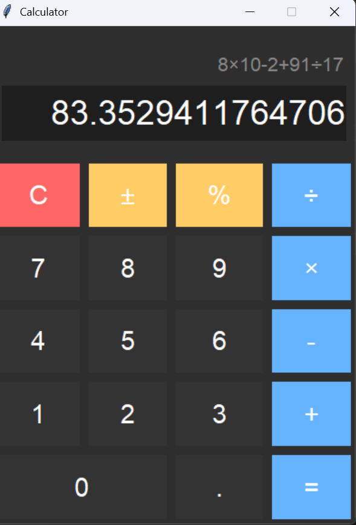

# Tkinter Calculator

<div style="display: flex; align-items: center;">

<div style="flex: 1; padding-right: 20px;">

A modern calculator built using Python and Tkinter with a dark theme, colorful buttons, and keyboard support.

**Features:**
- Basic arithmetic operations: `+`, `-`, `×`, `÷`
- Percent `%` and sign toggle `±`
- Decimal numbers support
- Clear (`C`) and backspace support
- Enter key to calculate (`=`) and Backspace to delete last character
- Modern dark theme with colorful buttons
- Compact layout

</div>

<div style="flex: 1;">

</div>

</div>

---

## Installation

Make sure you have **Python 3.x** installed.

```bash
git clone https://github.com/tsion-syseng/tkinter-calculator.git
cd tkinter-calculator

